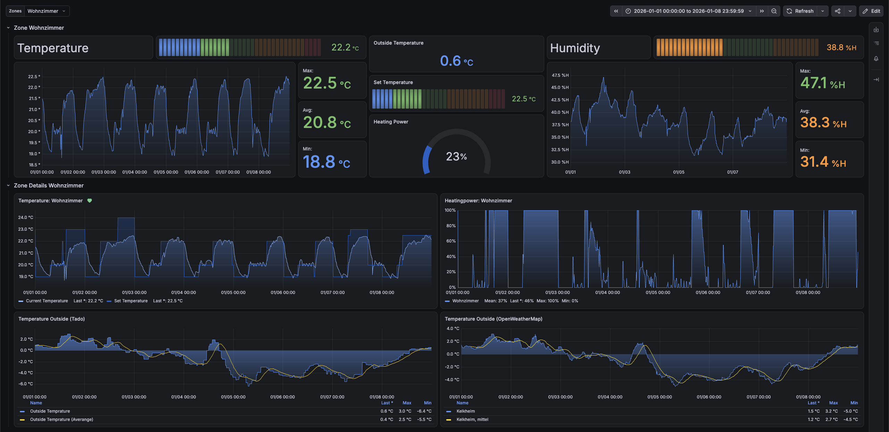
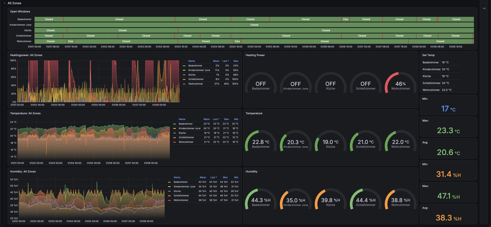

# 🌡️ tado° Prometheus Exporter

[](https://hub.docker.com/r/iamtheloki/tado-exporter)
[](https://hub.docker.com/r/iamtheloki/tado-exporter)
[](https://github.com/IamTheLoki/tado-exporter/pkgs/container/tado-exporter)
[](https://www.rust-lang.org/)
[](https://grafana.com/grafana/dashboards/13847-tado-dashboard/)

A lightweight, high-performance [Prometheus](https://prometheus.io/) exporter written in Rust for [tado°](https://www.tado.com/) smart climate control systems.

---

## 📊 Dashboards & Visualizations

Integrate seamless smart home monitoring into your Grafana setups.

| Main Overview | Zone Breakdown |
|:---:|:---:|
|  |  |

👉 **Official Grafana Dashboard Template:** [Dashboards / 13847-tado-dashboard](https://grafana.com/grafana/dashboards/13847-tado-dashboard/)

---

## ✨ Features

- **Zone Metrics:** Target temperatures, actual temperatures, humidity, heating power percentage, and AC power status.
- **Window Open Detection:** Gauge metric indicating whether an open window is detected per zone.
- **Outside Weather Data:** Outside ambient temperature and solar intensity percentages.
- **Drift-Free Interval Ticker:** Uses async Tokio intervals to ensure precise metrics retrieval without scheduling drift.
- **Low Footprint:** Built with Rust, Tokio, and Hyper for minimal memory and CPU usage.

---

## 🚀 Quick Start

### Option 1: Docker Compose (Recommended)

Add `tado-exporter` to your `docker-compose.yml`:

```yaml
version: "3.8"

services:
  tado-exporter:
    image: ghcr.io/iamtheloki/tado-exporter:latest
    container_name: tado-exporter
    restart: unless-stopped
    ports:
      - "9898:9898"
    network_mode: bridge
    environment:
      EXPORTER_USERNAME: "your-email@example.com"
      EXPORTER_PASSWORD: "your-password"
      EXPORTER_TICKER: "10"
```

Run with:
```bash
docker compose up -d
```

### Option 2: Docker CLI

```bash
docker run -d \
  --name tado-exporter \
  -p 9898:9898 \
  -e EXPORTER_USERNAME="your-email@example.com" \
  -e EXPORTER_PASSWORD="your-password" \
  ghcr.io/iamtheloki/tado-exporter:latest
```

*Note: You can also use `iamtheloki/tado-exporter:latest` from Docker Hub.*

### Option 3: Building from Source

**Prerequisites:** [Rust & Cargo](https://rustup.rs/)

```bash
# Clone the repository
git clone https://github.com/IamTheLoki/tado-exporter.git
cd tado-exporter

# Build release binary
cargo build --release

# Run exporter
export EXPORTER_USERNAME="your-email@example.com"
export EXPORTER_PASSWORD="your-password"
./target/release/tado-exporter
```

---

## ⚙️ Configuration

Configure the exporter using environment variables:

| Environment Variable | Default | Required | Description |
| :--- | :---: | :---: | :--- |
| `EXPORTER_USERNAME` | — | **Yes** | Your tado° account username / email address |
| `EXPORTER_PASSWORD` | — | **Yes** | Your tado° account password |
| `EXPORTER_CLIENT_ID` | `1bb50063-...` | No | OAuth client ID for tado° API authentication |
| `EXPORTER_TICKER` | `10` | No | Fetch interval in seconds |
| `RUST_LOG` | `info` | No | Logging verbosity (`error`, `warn`, `info`, `debug`, `trace`) |

---

## 📈 Exported Metrics

| Metric Name | Type | Labels | Description |
| :--- | :---: | :--- | :--- |
| `tado_sensor_temperature_value` | Gauge | `zone`, `type`, `unit` | Temperature detected by sensor in zone (`celsius` or `fahrenheit`) |
| `tado_setting_temperature_value` | Gauge | `zone`, `type`, `unit` | Programmed target temperature in zone (`celsius` or `fahrenheit`) |
| `tado_sensor_humidity_percentage` | Gauge | `zone`, `type` | Relative humidity percentage detected in zone |
| `tado_activity_heating_power_percentage` | Gauge | `zone`, `type` | Current heating power percentage per zone (0–100%) |
| `tado_activity_ac_power_value` | Gauge | `zone`, `type` | AC power status per zone (`1.0` = ON, `0.0` = OFF) |
| `tado_sensor_window_opened` | Gauge | `zone`, `type` | Open window detection state (`1.0` = open, `0.0` = closed) |
| `weather_outside_temperature` | Gauge | `unit` | Outside ambient temperature (`celsius` or `fahrenheit`) |
| `weather_solar_intensity` | Gauge | — | Outside solar intensity percentage |

---

## 🔍 Prometheus Configuration

Add the scraping job to your `prometheus.yml`:

```yaml
scrape_configs:
  - job_name: "tado"
    scrape_interval: 15s
    static_configs:
      - targets: ["tado-exporter:9898"]
```

---

## 📄 License

This project is licensed under the terms of the repository license. See [LICENSE](LICENSE) for details.
